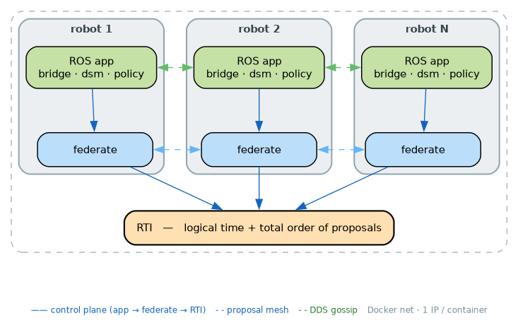
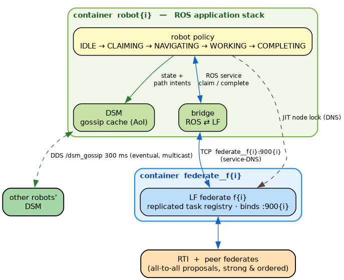

# Context-Fabric Emulation Testbed

Quantitative validation of the federated coordination architecture by **emulating N
robots as isolated containers** on a single workstation. Unlike a shared-host setup,
**every container has its own network interface + IP** on a Docker bridge network
(`lf`) — realistic for "each robot is its own machine." The robot **policy is a
state machine** (deterministic, so results isolate coordination from policy noise).

Each emulated robot is **two containers** on the `lf` network — modeling a robot that
carries a **coordination microservice** alongside its application stack (an app
container + per-function sidecar, a common edge/robotics pattern):
- `federate__f{i}` — the robot's Lingua Franca **coordination microservice** (control plane, its own IP),
- `robot{i}` — the robot's **ROS application stack** (bridge + DSM + policy, its own IP),

plus a shared `rti` and a `metrics` aggregator. The two co-located services talk over the
`lf` bridge by service-DNS. Control plane = LF (strong); data plane = ROS2 **DDS multicast**
on the bridge (eventual).

> **Why this design:** LF federates compiled for host networking segfault on a bridge
> (they advertise `localhost`). The supported fix is LF's own Docker support
> (`target Python { docker: true }`), which generates the per-federate images + a
> compose where federates address each other by service name on the `lf` bridge — no
> host networking, real per-container isolation. See `memory` / `gen_lf.py --docker`.

## Architecture

### 1. Whole testbed (isolated per-container networks)



### 2. One robot = two isolated containers



### 3. Task lifecycle (and where each metric is measured)

1. **Create** — `task_spawner` → `robot1` bridge → `federate__f1` → broadcast to **all**
   federates (RTI-ordered) → task enters the replicated registry.
2. **Discover** — `robot_i` calls `get_available_tasks` (served locally by `federate__f{i}`),
   picks the **nearest** task.
3. **Claim** — `robot_i` → `federate__f{i}` (DNS) → broadcast → deterministic winner.
   *`T_claim` measured on this round-trip.*
4. **Navigate** — A* avoiding peers' DSM path intents; one hop per `step_time_s`.
5. **Work** — JIT node lock, `work_time_s` (45 s).
6. **Complete** — `robot_i` → federate → broadcast → `/task_events COMPLETED` → `metrics`.
   *latency = COMPLETED−CREATED · completion = done/created · throughput = done/s · util = %WORKING.*

## Quick start

```bash
# Isolated-network sweep (sizes/seeds/duration from config/testbed.yaml).
# First run builds the ROS image + per-N LF federate images.
scripts/run_sweep_iso.sh

# Smoke first (recommended): N=2 for 60 s
scripts/run_sweep_iso.sh "2" 60

# Realistic-network pass: 20 ms per-container netem (needs iproute2 in the ROS image)
NETEM_MS=20 LABEL=netem20 scripts/run_sweep_iso.sh "8 16" 240
```

Results → `results/` (CSV + markdown + LaTeX, mean±sd over seeds); figures → `figures/testbed/`.

## Configuration — `config/testbed.yaml` (single source of truth)

`fleet_sizes`, `run.{duration_s,seed,seeds,warmup_s}`, `tasks.arrival_rate_per_robot`,
`timing.{step_time_s,work_time_s}` (default to the sim's 2 s/cell + 45 s work), graph size.

## Pieces

| File | Role |
|------|------|
| `scripts/gen_lf.py --docker` | Generate the federated LF program + lfc's per-federate Dockerfiles + `docker-compose.yml` (service-DNS on the `lf` bridge) |
| `scripts/gen_compose_ros.py` | Generate `docker-compose.ros.<N>.yml` (robot stacks + metrics) merged onto the `lf` network |
| `scripts/gen_graph.py` | Grid `config/warehouse_graph.yaml` (~4 % density at max N) |
| `scripts/start_robot_ros.sh` | Launch one robot's bridge+dsm+policy; reaches its federate by `LF_FED_HOST` DNS |
| `scripts/task_spawner.py` | Poisson task stream → `/robot_1/coord/create_task` |
| `scripts/run_sweep_iso.sh` | Drive the isolated-net sweep (per-N build + merge-compose + multi-seed + optional netem) |
| `scripts/report.py` | Aggregate `logs/` → mean±sd tables + error-bar figures |
| `src/common/common/metrics_node.py` | Computes the 4 metrics, writes per-run summary |

## Metrics (same definitions as the thesis simulation)

- **completion rate** = completed / created   - **throughput** = completed / wall-second
- **latency** = create→complete (avg/P50/P90/P99 s)   - **utilization** = per-robot %WORKING, fleet-avg
- **overhead**: `T_claim` (claim round-trip, ms) and AoI (gossip staleness, ms)

## Hardening & threats to validity

- **Isolation:** each federate and each robot stack is its own container with its own IP on
  the `lf` bridge (not shared host). Control plane via service-DNS; data plane via DDS multicast
  (verified to discover across containers on the bridge).
- **Statistics:** 3 seeds (`run.seeds`), reported as **mean ± sd**. Small fleets (N=2,4) see
  few tasks; widen with longer `run.duration_s`.
- **CPU:** at N=16 host load was ~9–13 of 12 cores (~45 %); not saturated. `T_claim` growth is
  genuine coordination cost, not host starvation.
- **Network realism (netem):** with isolated containers, `tc netem` is applied **inside each
  robot container** on `eth0` (`NET_ADMIN`, no host sudo) via `NETEM_MS`. Shapes the
  robot-observed path (robot→federate control + robot↔robot DDS). Loopback baseline ≈ best case;
  netem runs approximate a real robot network.
- **Resource ceiling:** N=16 isolated ≈ 16 federate + 16 robot + rti + metrics ≈ 34 containers.
  Federate images are tiny `python:3.10-alpine`; robot stacks are the ROS image.

## Notes

- LF federation size is fixed at compile time, so each fleet size compiles its own program
  (`gen_lf.py --docker --sizes N`) and builds N federate images. Cached after first build.
- Keep `gen_lf.py --sizes` in `Dockerfile.fed` (host-net fallback) and the sweep in sync with
  `fleet_sizes`.
- Logs are written by in-container root; `results/` by your user.
